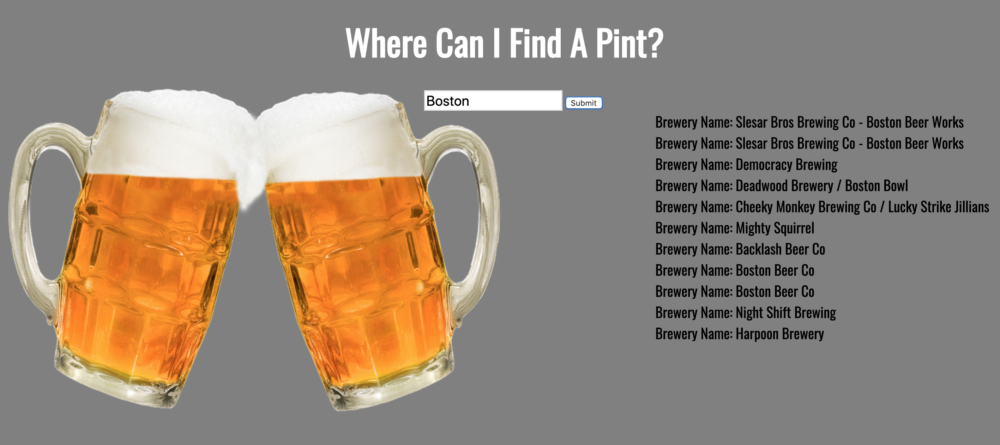

# Brewery API
This project focuses on an open brewery API. When the user inputs a city they are visiting or where they are from it locates all breweries within their city.

**Tech used:**
HTML, CSS, & JavaScript

## Lessons Learned:

This project was a bit complex. I applied a new array method to learn the functionality and where to apply it. Though I got a bit lost I really learned the importance of using variable names that go precisely with what needs to be targeted because it is easy to confuse yourself. .

