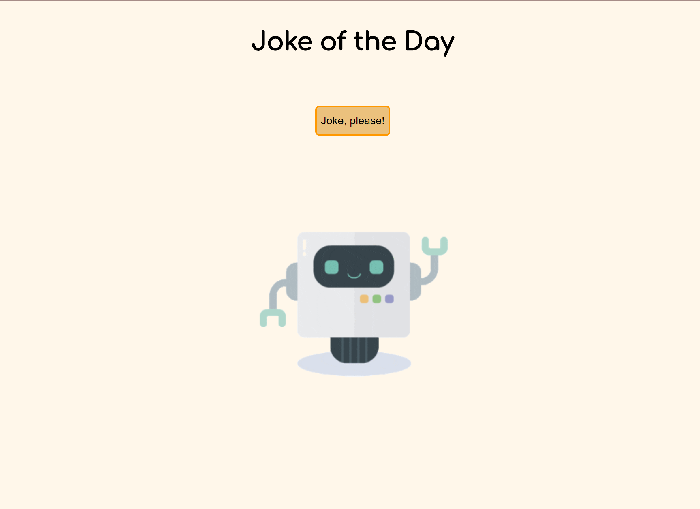

# 🤖 Project: Simple API 2 🃏

Live Code: https://kimflores-code-jokes.netlify.app

# How It's Made:
### Tech used: 
HTML, CSS and JS. Used the JokeAPI that returned programmming jokes.

# Lessons Learned:
This project was pretty straight forward and helped with better understanding APIs. I learned how to fetch the API and place data within the DOM.

# Examples:

Take a look at these couple examples that I have in my own portfolio:

Simple NASA API: https://github.com/Kim-Flores/simple-nasa-api-bootcamp/tree/answer

Complex NASA API: https://github.com/Kim-Flores/complex-nasa-bootcamp/tree/answer

Music API: https://github.com/Kim-Flores/complex-api-bootcamp/tree/answer

Book API: https://github.com/Kim-Flores/complex-api2-bootcamp/tree/answer

Weather API: https://github.com/Kim-Flores/weather-api-bootcamp/tree/answer

Dog Facts API: https://github.com/Kim-Flores/simple-api-bootcamp/tree/answer
