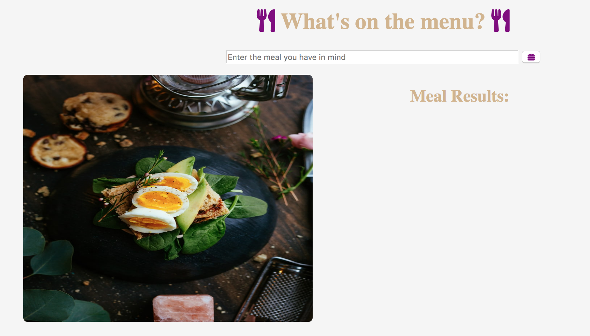
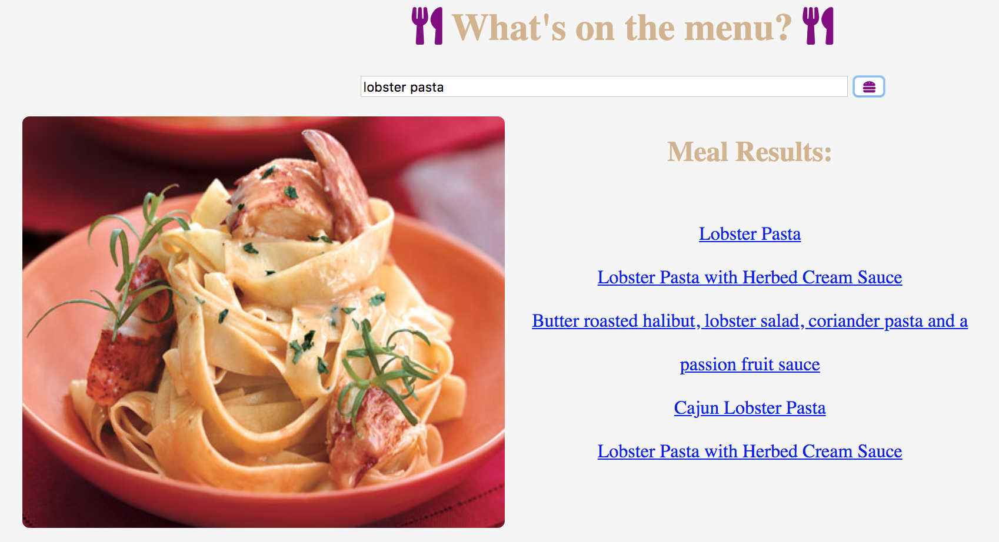

# 📊 Project: Simple API 2

### Goal: Display data returned from an api

* **Project Title: What's on the menu?**
  - "What's on the menu?" is a webpage that gives you a list of 5 meal options based on the keyword you enter. It also includes a direct think to the recipe of your choosing.

* **Overview**
  - It pulls data from the "food2fork" API. It receives a list of meals, including the url link to that exact meals recipe. Including step by step directions, videos, pictures and recommendations.
  - This page was created for anyone wanting to change up what they eat on a regular basis but unsure what to make. It gives you meal inspiration, and the convenience of having the meal directions a click away.

* **link to project**: https://serene-volhard-19a165.netlify.com

* **Image of project**

* **Image of project in use**

* **Getting Started**
  - Click on the link above
  - Enter the meal you have in mind, it can be as vague as an ingredient(ex: cheese, thai salad, lobster pasta)
  - click on the "hamburger" button to unlock a few delicious meal choices Enjoy! :)
