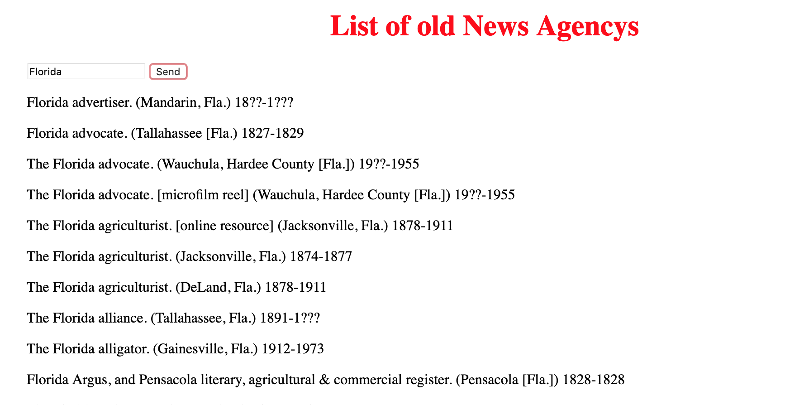

# My Awesome Project
In this application the user can enter a state and recieve the past news agencies that were once in business.

## How It's Made:

**Tech used:** HTML, CSS, JavaScript, Framework of choice

In this project I used an API that had the proved me the names of old new agencies and the dates they were founded and the dates they went out of business.

## Lessons Learned:

I learned somewhat how to go through the indexes of the objects in an array from an API.

