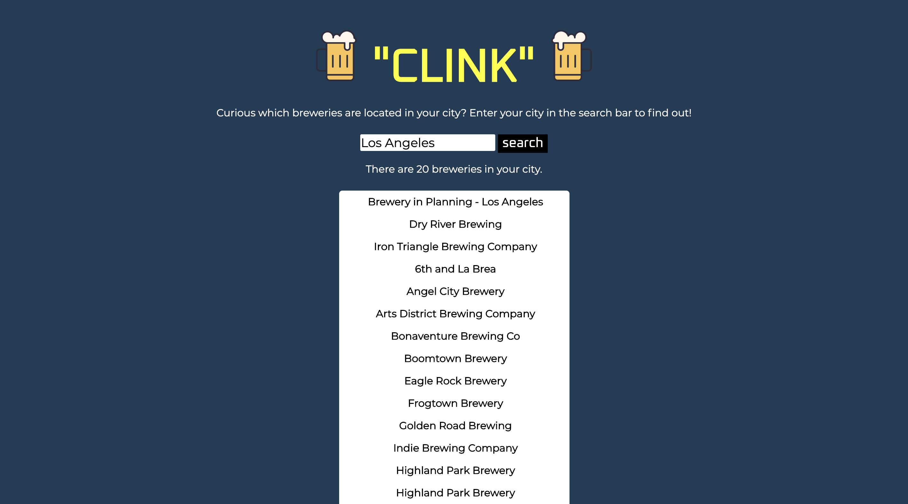

# Simple API 2: "CLINK"
#### Project Scope: Enter your city or a city of interest to receive an unordered list of all breweries in the area. 
#### View here: https://svdev-brewery.netlify.com

# How it was made:
#### HTML5, CSS3, Javascript E6, API, JSON

# Optimizations:
#### When the names of breweries in your city are displayed on the DOM, the number of breweries is listed as well for accuracy. 

# Lesson Learned: 
#### API's provide a significant amount of data that can be incorporated into web applications utilizing the fetch method. 
