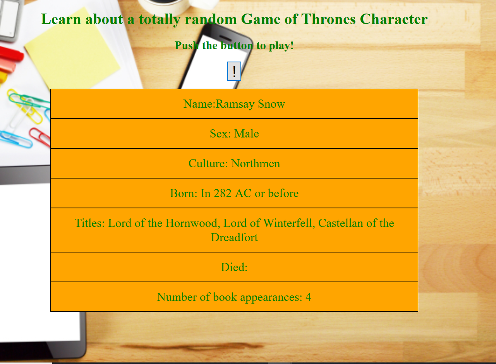

# 📊 Project: Simple API 2
link: https://hardcore-fermat-7eba44.netlify.com/
### Goal: Display data returned from an api

### How I did it:

- Set up fields that can be appended to and a button in the html
- Added event listener to button, when clicked triggers a function call
- Random nuumber is generated that can be used to search the API's database 
- Database is searched based on ID for that random character, an object is returned with information on the character
- The returned info is appended to their corresponding locations in the DOM

